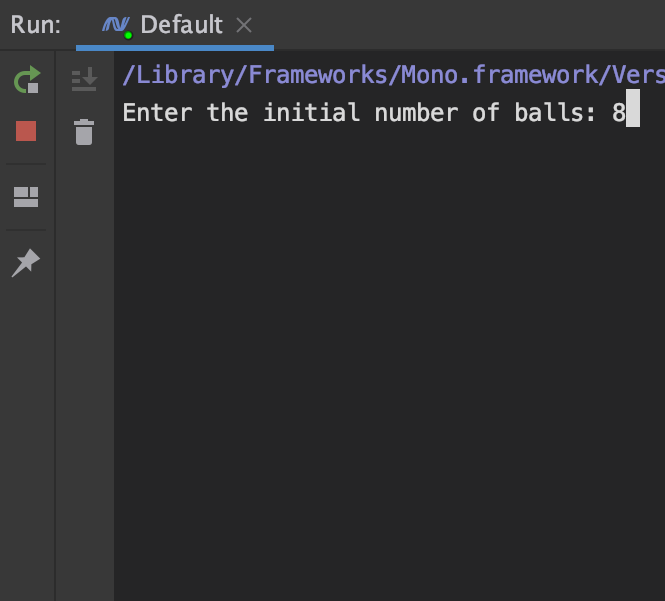
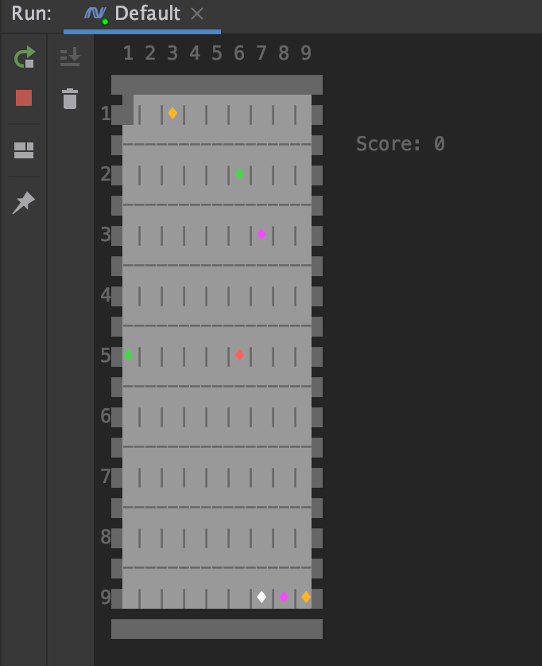
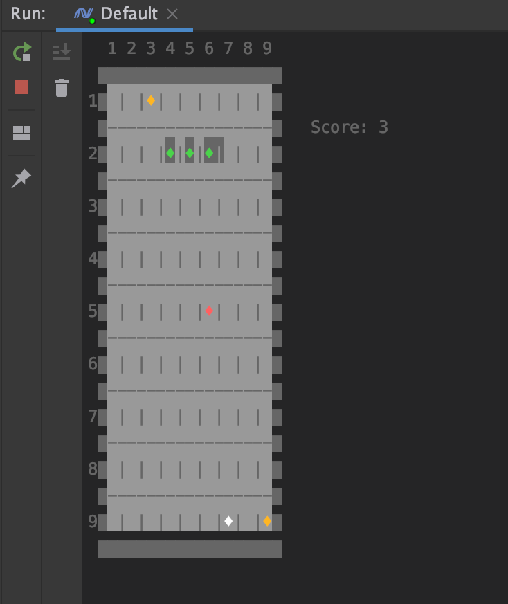

# BALLS
Console game, C\#

## Concept
- A square board 9 x 9 
- Balls can be placed on each of 81 cells of the board
- Balls in seven colors: black, red, yellow, white, green, blue and magenta
- Score-meter to the right from the board

## Aim
To clear the board by getting rid of balls.

You should place 3 or more balls of the same color along one diagonal, gorizontal or vertical line. These balls disappear.

## How it goes
1. When you start the game, you have to enter the initial amount of balls = how many balls you want to have on your board before your first move. 

You should enter the number between 1 and 81, both including. Otherwise, you will get the message about your number being invalid with no ability to continue the game.

2. Afterwards the board will appear. The demanded amount off balls will be placed randomly all around it. Colors are chosen randomly as well.

3. Cursor is in the upper left conner by default. It is set there in the begining of every move. You should move the cursor, using arrow keys on your keyboard. When you reach the ball you want to move, tap the "Enter" key. Now you can move the cursor together with the chosen ball. Note, that you can't move the ball through occupied cells - you have to go around them through the free ones. As you reach the demanded cell, tap enter.

If you hit the line of the same-colored balls, they will be highlited for a while.

Afterwards, your score gets recounted (if needed), your cursor returns to the default position, and one randomly-colored ball appears on a random free cell. If accidentally "the line" gets complete, reset happens again.

4. Game ends in three conditions.

First (EMERGENCY EXIT): if you hit "Space" button, the game will finish. You will get a message about the game being interrupted and your score.

Second: you clear the board - YOU WIN

Third: the is no free space left on the board, and no lines to hit - YOU LOSE
